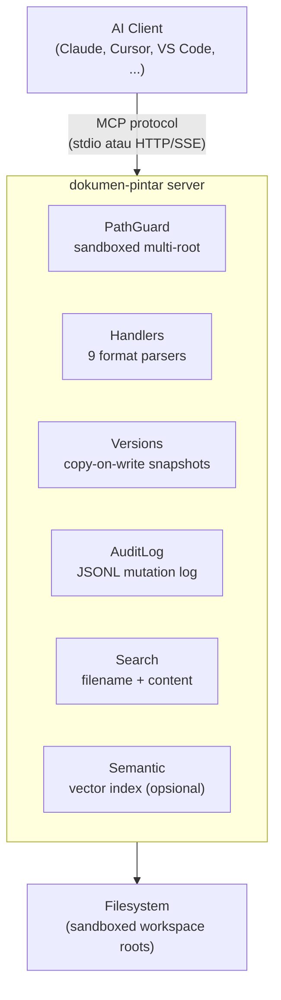

<p align="center">
  
</p>

<h1 align="center">Dokumen-Pintar</h1>

<p align="center"><b>MCP server universal untuk CRUD dokumen lintas format</b></p>

<p align="center">
Baca, tulis, cari, dan kelola file teks, Office, dan PDF<br>
dari AI agent manapun yang mendukung <a href="https://modelcontextprotocol.io/">Model Context Protocol</a>.
</p>

<p align="center">
  <a href="https://pypi.org/project/dokumen-pintar/"></a>&nbsp;
  <a href="https://python.org"></a>&nbsp;
  <a href="LICENSE"></a>&nbsp;
  <a href="tests/"></a>&nbsp;
  <a href="htmlcov/"></a>
</p>

<p align="center">
  <a href="#fitur">Fitur</a>
  <span>&nbsp;&middot;&nbsp;</span>
  <a href="#format-yang-didukung">Format</a>
  <span>&nbsp;&middot;&nbsp;</span>
  <a href="#quick-start">Quick Start</a>
  <span>&nbsp;&middot;&nbsp;</span>
  <a href="#daftar-tools">Tools</a>
  <span>&nbsp;&middot;&nbsp;</span>
  <a href="docs/">Docs</a>
  <span>&nbsp;&middot;&nbsp;</span>
  <a href="#kontribusi">Kontribusi</a>
</p>

<p align="center"><b><a href="README.md">Read in English</a></b></p>

<p align="center">
  <svg width="100%" height="2" xmlns="http://www.w3.org/2000/svg" role="presentation"><defs><linearGradient id="hd" x1="0" x2="1" y1="0" y2="0"><stop offset="0" stop-color="#1e3a5f" stop-opacity="0"/><stop offset=".5" stop-color="#1e3a5f"/><stop offset="1" stop-color="#1e3a5f" stop-opacity="0"/></linearGradient></defs><rect width="100%" height="2" fill="url(#hd)"/></svg>
</p>

## <svg xmlns="http://www.w3.org/2000/svg" width="22" height="22" viewBox="0 0 24 24" fill="none" stroke="currentColor" stroke-width="2" stroke-linecap="round" stroke-linejoin="round"><path d="M9.937 15.5A2 2 0 0 0 8.5 14.063l-6.135-1.582a.5.5 0 0 1 0-.962L8.5 9.936A2 2 0 0 0 9.937 8.5l1.582-6.135a.5.5 0 0 1 .963 0L14.063 8.5A2 2 0 0 0 15.5 9.937l6.135 1.581a.5.5 0 0 1 0 .964L15.5 14.063a2 2 0 0 0-1.437 1.437l-1.582 6.135a.5.5 0 0 1-.963 0z"/><path d="M20 3v4"/><path d="M22 5h-4"/><path d="M4 17v2"/><path d="M5 18H3"/></svg> Fitur

<table>
<tr>
<td width="50%" valign="top">

**Multi-root Sandbox** — Definisikan beberapa workspace root dengan kontrol `writable` per-root. Semua path di luar sandbox ditolak otomatis.

**10 Format** — Plain text, Markdown, JSON, YAML, CSV/TSV, XML/SVG, DOCX, XLSX, PPTX, PDF.

**30 MCP Tools** — CRUD file & konten, structured access, batch operations, search, versioning — semua tersedia sebagai tool yang bisa dipanggil AI agent.

**Versioning Otomatis** — Snapshot copy-on-write di setiap operasi tulis. Undo, diff, restore, dan purge kapan saja.

</td>
<td width="50%" valign="top">

**Structured Access** — JSONPath untuk JSON/YAML, XPath untuk XML, cell/range/sheet untuk XLSX, paragraph/table untuk DOCX, slide untuk PPTX, page untuk PDF.

**Batch Operations** — Rename, find-and-replace, dan delete massal dengan dry-run default.

**Semantic Search** *(opsional)* — Vector search berbasis sentence-transformers; aktifkan lewat config.

**Audit Trail** — Setiap mutasi dicatat ke file JSONL dengan timestamp dan detail operasi.

**2 Transport** — stdio (Claude Desktop, Cursor, VS Code, Windsurf) dan HTTP/SSE.

</td>
</tr>
</table>

---

## <svg xmlns="http://www.w3.org/2000/svg" width="22" height="22" viewBox="0 0 24 24" fill="none" stroke="currentColor" stroke-width="2" stroke-linecap="round" stroke-linejoin="round"><path d="m12.83 2.18a2 2 0 0 0-1.66 0L2.6 6.08a1 1 0 0 0 0 1.83l8.58 3.91a2 2 0 0 0 1.66 0l8.58-3.91a1 1 0 0 0 0-1.83Z"/><path d="m6.08 9.5-3.5 1.6a1 1 0 0 0 0 1.81l8.6 3.91a2 2 0 0 0 1.65 0l8.58-3.9a1 1 0 0 0 0-1.83l-3.5-1.59"/><path d="m6.08 14.5-3.5 1.6a1 1 0 0 0 0 1.81l8.6 3.91a2 2 0 0 0 1.65 0l8.58-3.9a1 1 0 0 0 0-1.83l-3.5-1.59"/></svg> Format yang Didukung

| Format | Baca | Tulis | Structured Query | Search |
|:-------|:----:|:-----:|:-----------------|:------:|
| **Plain text / Markdown** | <svg xmlns="http://www.w3.org/2000/svg" width="16" height="16" viewBox="0 0 24 24" fill="none" stroke="#10b981" stroke-width="3" stroke-linecap="round" stroke-linejoin="round"><path d="M20 6 9 17l-5-5"/></svg> | <svg xmlns="http://www.w3.org/2000/svg" width="16" height="16" viewBox="0 0 24 24" fill="none" stroke="#10b981" stroke-width="3" stroke-linecap="round" stroke-linejoin="round"><path d="M20 6 9 17l-5-5"/></svg> | — | <svg xmlns="http://www.w3.org/2000/svg" width="16" height="16" viewBox="0 0 24 24" fill="none" stroke="#10b981" stroke-width="3" stroke-linecap="round" stroke-linejoin="round"><path d="M20 6 9 17l-5-5"/></svg> |
| **JSON** | <svg xmlns="http://www.w3.org/2000/svg" width="16" height="16" viewBox="0 0 24 24" fill="none" stroke="#10b981" stroke-width="3" stroke-linecap="round" stroke-linejoin="round"><path d="M20 6 9 17l-5-5"/></svg> | <svg xmlns="http://www.w3.org/2000/svg" width="16" height="16" viewBox="0 0 24 24" fill="none" stroke="#10b981" stroke-width="3" stroke-linecap="round" stroke-linejoin="round"><path d="M20 6 9 17l-5-5"/></svg> | JSONPath `$.key` | <svg xmlns="http://www.w3.org/2000/svg" width="16" height="16" viewBox="0 0 24 24" fill="none" stroke="#10b981" stroke-width="3" stroke-linecap="round" stroke-linejoin="round"><path d="M20 6 9 17l-5-5"/></svg> |
| **YAML** | <svg xmlns="http://www.w3.org/2000/svg" width="16" height="16" viewBox="0 0 24 24" fill="none" stroke="#10b981" stroke-width="3" stroke-linecap="round" stroke-linejoin="round"><path d="M20 6 9 17l-5-5"/></svg> | <svg xmlns="http://www.w3.org/2000/svg" width="16" height="16" viewBox="0 0 24 24" fill="none" stroke="#10b981" stroke-width="3" stroke-linecap="round" stroke-linejoin="round"><path d="M20 6 9 17l-5-5"/></svg> | JSONPath `$.key` | <svg xmlns="http://www.w3.org/2000/svg" width="16" height="16" viewBox="0 0 24 24" fill="none" stroke="#10b981" stroke-width="3" stroke-linecap="round" stroke-linejoin="round"><path d="M20 6 9 17l-5-5"/></svg> |
| **CSV / TSV** | <svg xmlns="http://www.w3.org/2000/svg" width="16" height="16" viewBox="0 0 24 24" fill="none" stroke="#10b981" stroke-width="3" stroke-linecap="round" stroke-linejoin="round"><path d="M20 6 9 17l-5-5"/></svg> | <svg xmlns="http://www.w3.org/2000/svg" width="16" height="16" viewBox="0 0 24 24" fill="none" stroke="#10b981" stroke-width="3" stroke-linecap="round" stroke-linejoin="round"><path d="M20 6 9 17l-5-5"/></svg> | `row:N` · `col:N` · `cell:R,C` | <svg xmlns="http://www.w3.org/2000/svg" width="16" height="16" viewBox="0 0 24 24" fill="none" stroke="#10b981" stroke-width="3" stroke-linecap="round" stroke-linejoin="round"><path d="M20 6 9 17l-5-5"/></svg> |
| **XML / SVG** | <svg xmlns="http://www.w3.org/2000/svg" width="16" height="16" viewBox="0 0 24 24" fill="none" stroke="#10b981" stroke-width="3" stroke-linecap="round" stroke-linejoin="round"><path d="M20 6 9 17l-5-5"/></svg> | <svg xmlns="http://www.w3.org/2000/svg" width="16" height="16" viewBox="0 0 24 24" fill="none" stroke="#10b981" stroke-width="3" stroke-linecap="round" stroke-linejoin="round"><path d="M20 6 9 17l-5-5"/></svg> | XPath `//node` | <svg xmlns="http://www.w3.org/2000/svg" width="16" height="16" viewBox="0 0 24 24" fill="none" stroke="#10b981" stroke-width="3" stroke-linecap="round" stroke-linejoin="round"><path d="M20 6 9 17l-5-5"/></svg> |
| **DOCX** | <svg xmlns="http://www.w3.org/2000/svg" width="16" height="16" viewBox="0 0 24 24" fill="none" stroke="#10b981" stroke-width="3" stroke-linecap="round" stroke-linejoin="round"><path d="M20 6 9 17l-5-5"/></svg> | <svg xmlns="http://www.w3.org/2000/svg" width="16" height="16" viewBox="0 0 24 24" fill="none" stroke="#10b981" stroke-width="3" stroke-linecap="round" stroke-linejoin="round"><path d="M20 6 9 17l-5-5"/></svg> | `paragraph:N` · `table:N` | <svg xmlns="http://www.w3.org/2000/svg" width="16" height="16" viewBox="0 0 24 24" fill="none" stroke="#10b981" stroke-width="3" stroke-linecap="round" stroke-linejoin="round"><path d="M20 6 9 17l-5-5"/></svg> |
| **XLSX** | <svg xmlns="http://www.w3.org/2000/svg" width="16" height="16" viewBox="0 0 24 24" fill="none" stroke="#10b981" stroke-width="3" stroke-linecap="round" stroke-linejoin="round"><path d="M20 6 9 17l-5-5"/></svg> | <svg xmlns="http://www.w3.org/2000/svg" width="16" height="16" viewBox="0 0 24 24" fill="none" stroke="#10b981" stroke-width="3" stroke-linecap="round" stroke-linejoin="round"><path d="M20 6 9 17l-5-5"/></svg> | `cell:Sheet!A1` · `range:` · `sheet:` | <svg xmlns="http://www.w3.org/2000/svg" width="16" height="16" viewBox="0 0 24 24" fill="none" stroke="#10b981" stroke-width="3" stroke-linecap="round" stroke-linejoin="round"><path d="M20 6 9 17l-5-5"/></svg> |
| **PPTX** | <svg xmlns="http://www.w3.org/2000/svg" width="16" height="16" viewBox="0 0 24 24" fill="none" stroke="#10b981" stroke-width="3" stroke-linecap="round" stroke-linejoin="round"><path d="M20 6 9 17l-5-5"/></svg> | <svg xmlns="http://www.w3.org/2000/svg" width="16" height="16" viewBox="0 0 24 24" fill="none" stroke="#10b981" stroke-width="3" stroke-linecap="round" stroke-linejoin="round"><path d="M20 6 9 17l-5-5"/></svg> | `slide:N` · `slide_title:N` | <svg xmlns="http://www.w3.org/2000/svg" width="16" height="16" viewBox="0 0 24 24" fill="none" stroke="#10b981" stroke-width="3" stroke-linecap="round" stroke-linejoin="round"><path d="M20 6 9 17l-5-5"/></svg> |
| **PDF** | <svg xmlns="http://www.w3.org/2000/svg" width="16" height="16" viewBox="0 0 24 24" fill="none" stroke="#10b981" stroke-width="3" stroke-linecap="round" stroke-linejoin="round"><path d="M20 6 9 17l-5-5"/></svg> | <svg xmlns="http://www.w3.org/2000/svg" width="16" height="16" viewBox="0 0 24 24" fill="none" stroke="#6b7280" stroke-width="3" stroke-linecap="round"><line x1="5" y1="12" x2="19" y2="12"/></svg> | `page:N` · `outline` · `metadata` | <svg xmlns="http://www.w3.org/2000/svg" width="16" height="16" viewBox="0 0 24 24" fill="none" stroke="#10b981" stroke-width="3" stroke-linecap="round" stroke-linejoin="round"><path d="M20 6 9 17l-5-5"/></svg> |

---

## <svg xmlns="http://www.w3.org/2000/svg" width="22" height="22" viewBox="0 0 24 24" fill="none" stroke="currentColor" stroke-width="2" stroke-linecap="round" stroke-linejoin="round"><path d="M4.5 16.5c-1.5 1.26-2 5-2 5s3.74-.5 5-2c.71-.84.7-2.13-.09-2.91a2.18 2.18 0 0 0-2.91-.09z"/><path d="M12 15l-3-3a22 22 0 0 1 2-3.95A12.88 12.88 0 0 1 22 2c0 2.72-.78 7.5-6 11a22.35 22.35 0 0 1-4 2z"/><path d="M9 12H4s.55-3.03 2-4c1.62-1.08 5 0 5 0"/><path d="M12 15v5s3.03-.55 4-2c1.08-1.62 0-5 0-5"/></svg> Quick Start

### 1. Install

```bash
pip install dokumen-pintar
```

<details>
<summary><b>Dari source (development)</b></summary>

```bash
git clone https://github.com/firdausmntp/Dokumen-Pintar.git
cd Dokumen-Pintar
pip install -e ".[dev]"
```

</details>

<details>
<summary><b>Dengan semantic search</b></summary>

```bash
pip install dokumen-pintar[semantic]
```

</details>

### 2. Buat Config

```bash
dokumen-pintar-init
```

Atau buat manual:

```jsonc
{
  "roots": [
    { "name": "documents", "path": "~/Documents", "writable": true },
    { "name": "projects",  "path": "~/Projects",  "writable": true }
  ]
}
```

> Semua field lain opsional dengan default yang masuk akal. Lihat **[docs/CONFIG.md](docs/CONFIG.md)**.

### 3. Jalankan

```bash
dokumen-pintar --config dokumen-pintar.config.json
```

### 4. Hubungkan ke AI Client

<details>
<summary><b>Claude Desktop</b></summary>

Tambahkan ke `claude_desktop_config.json`:

```json
{
  "mcpServers": {
    "dokumen-pintar": {
      "command": "dokumen-pintar",
      "args": ["--config", "/path/to/dokumen-pintar.config.json"]
    }
  }
}
```

</details>

<details>
<summary><b>Cursor / VS Code / Windsurf</b></summary>

Gunakan transport stdio yang sama. Arahkan pengaturan MCP di IDE ke command `dokumen-pintar` dan path config.

</details>

<details>
<summary><b>HTTP/SSE (remote atau multi-client)</b></summary>

```jsonc
{
  "transport": {
    "stdio": false,
    "http": { "enabled": true, "port": 7878 }
  }
}
```

Jalankan server dan arahkan client ke `http://127.0.0.1:7878`.

</details>

---

## <svg xmlns="http://www.w3.org/2000/svg" width="22" height="22" viewBox="0 0 24 24" fill="none" stroke="currentColor" stroke-width="2" stroke-linecap="round" stroke-linejoin="round"><path d="M15 14c.2-1 .7-1.7 1.5-2.5 1-.9 1.5-2.2 1.5-3.5A6 6 0 0 0 6 8c0 1 .2 2.2 1.5 3.5.7.7 1.3 1.5 1.5 2.5"/><path d="M9 18h6"/><path d="M10 22h4"/></svg> Contoh Penggunaan

```python
# Lihat workspace roots yang tersedia
workspace_list_roots()

# Baca dokumen Word
content_read(path="documents:/laporan/q1.docx")

# Buat file baru
file_create(path="documents:/notes/catatan.txt", content="Hello World")

# Find & replace di dalam file
content_replace(path="documents:/notes/catatan.txt", old="World", new="Dunia")

# Full-text search di semua PDF
search_content(query="anggaran 2024", format="pdf")

# Baca cell Excel
structured_get(path="documents:/data.xlsx", expr="cell:Sheet1!B2")

# Update key JSON
structured_set(path="documents:/config.json", expr="$.database.port", value=5432)

# Hapus node XML
structured_delete(path="documents:/data.xml", expr="//item[@id='old']")

# Batch rename (dry-run dulu)
batch_rename(glob="*.txt", pattern="draft_", replacement="final_", dry_run=true)

# Undo perubahan terakhir
version_undo(path="documents:/laporan/q1.docx")
```

> Panduan lengkap dan resep praktis: **[docs/USAGE.md](docs/USAGE.md)**

---

## <svg xmlns="http://www.w3.org/2000/svg" width="22" height="22" viewBox="0 0 24 24" fill="none" stroke="currentColor" stroke-width="2" stroke-linecap="round" stroke-linejoin="round"><path d="M14.7 6.3a1 1 0 0 0 0 1.4l1.6 1.6a1 1 0 0 0 1.4 0l3.77-3.77a6 6 0 0 1-7.94 7.94l-6.91 6.91a2.12 2.12 0 0 1-3-3l6.91-6.91a6 6 0 0 1 7.94-7.94l-3.76 3.76z"/></svg> Daftar Tools

**30 MCP tools** berdasarkan kategori:

| Kategori | Tools |
|:---------|:------|
| **Workspace** | `workspace_list_roots` · `workspace_stat` · `workspace_tree` |
| **File CRUD** | `file_create` · `file_delete` · `file_rename` · `file_copy` · `file_move` |
| **Content** | `content_read` · `content_write` · `content_append` · `content_insert` · `content_replace` · `content_patch` |
| **Structured** | `structured_get` · `structured_set` · `structured_delete` · `structured_meta` |
| **Batch** | `batch_rename` · `batch_replace_content` · `batch_delete` |
| **Search** | `search_filename` · `search_content` · `search_in_format` |
| **Versioning** | `version_list` · `version_diff` · `version_restore` · `version_undo` · `version_purge` |
| **Semantic** * | `semantic_index` · `semantic_search` |

<sub>* Hanya tersedia jika <code>semantic_search.enabled = true</code> dan extras <code>[semantic]</code> terinstall.</sub>

> Referensi lengkap parameter: **[docs/TOOLS.md](docs/TOOLS.md)**

---

## <svg xmlns="http://www.w3.org/2000/svg" width="22" height="22" viewBox="0 0 24 24" fill="none" stroke="currentColor" stroke-width="2" stroke-linecap="round" stroke-linejoin="round"><rect x="16" y="16" width="6" height="6" rx="1"/><rect x="2" y="16" width="6" height="6" rx="1"/><rect x="9" y="2" width="6" height="6" rx="1"/><path d="M5 16v-3a1 1 0 0 1 1-1h12a1 1 0 0 1 1 1v3"/><path d="M12 12V8"/></svg> Arsitektur



> Detail lengkap: **[docs/ARCHITECTURE.md](docs/ARCHITECTURE.md)**

---

## <svg xmlns="http://www.w3.org/2000/svg" width="22" height="22" viewBox="0 0 24 24" fill="none" stroke="currentColor" stroke-width="2" stroke-linecap="round" stroke-linejoin="round"><path d="M14.5 2v17.5c0 1.4-1.1 2.5-2.5 2.5c-1.4 0-2.5-1.1-2.5-2.5V2"/><path d="M8.5 2h7"/><path d="M14.5 16h-5"/></svg> Testing

```bash
pip install -e ".[dev]"
pytest
```

<table align="center">
<tr>
  <td align="center" width="25%">
    <h2>730</h2>
    <sub>Tests passed</sub>
  </td>
  <td align="center" width="25%">
    <h2>100%</h2>
    <sub>Line + branch coverage</sub>
  </td>
  <td align="center" width="25%">
    <h2>80%</h2>
    <sub>Minimum threshold</sub>
  </td>
  <td align="center" width="25%">
    <h2>-n auto</h2>
    <sub>Parallel via xdist</sub>
  </td>
</tr>
</table>

HTML coverage report: `htmlcov/index.html`

---

## <svg xmlns="http://www.w3.org/2000/svg" width="22" height="22" viewBox="0 0 24 24" fill="none" stroke="currentColor" stroke-width="2" stroke-linecap="round" stroke-linejoin="round"><path d="M4 19.5v-15A2.5 2.5 0 0 1 6.5 2H20v20H6.5a2.5 2.5 0 0 1 0-5H20"/></svg> Dokumentasi

| Dokumen | Isi |
|:--------|:----|
| **[USAGE.md](docs/USAGE.md)** | Workspace URI, contoh setiap tool, resep praktis |
| **[CONFIG.md](docs/CONFIG.md)** | Semua field config dengan tipe, default, dan catatan |
| **[TOOLS.md](docs/TOOLS.md)** | Referensi lengkap 30 tool |
| **[ARCHITECTURE.md](docs/ARCHITECTURE.md)** | Module map, request flow, versioning, safety |

---

## <svg xmlns="http://www.w3.org/2000/svg" width="22" height="22" viewBox="0 0 24 24" fill="none" stroke="currentColor" stroke-width="2" stroke-linecap="round" stroke-linejoin="round"><path d="M19 14c1.49-1.46 3-3.21 3-5.5A5.5 5.5 0 0 0 16.5 3c-1.76 0-3 .5-4.5 2-1.5-1.5-2.74-2-4.5-2A5.5 5.5 0 0 0 2 8.5c0 2.3 1.5 4.05 3 5.5l7 7Z"/></svg> Kontribusi

```bash
git clone https://github.com/firdausmntp/Dokumen-Pintar.git
cd Dokumen-Pintar
pip install -e ".[dev]"

ruff check src/             # lint
mypy src/dokumen_pintar/    # type check
pytest                      # test + coverage
```

PR welcome! Pastikan semua test pass dan coverage tidak turun.

---

## <svg xmlns="http://www.w3.org/2000/svg" width="22" height="22" viewBox="0 0 24 24" fill="none" stroke="currentColor" stroke-width="2" stroke-linecap="round" stroke-linejoin="round"><path d="M20 13c0 5-3.5 7.5-7.66 8.95a1 1 0 0 1-.67-.01C7.5 20.5 4 18 4 13V6a1 1 0 0 1 1-1c2 0 4.5-1.2 6.24-2.72a1.17 1.17 0 0 1 1.52 0C14.51 3.81 17 5 19 5a1 1 0 0 1 1 1z"/></svg> Lisensi

[MIT](LICENSE) — 2026 [firdausmntp](https://github.com/firdausmntp/Dokumen-Pintar)

<p align="center">
  <svg width="100%" height="2" xmlns="http://www.w3.org/2000/svg" role="presentation"><defs><linearGradient id="fd" x1="0" x2="1" y1="0" y2="0"><stop offset="0" stop-color="#1e3a5f" stop-opacity="0"/><stop offset=".5" stop-color="#1e3a5f"/><stop offset="1" stop-color="#1e3a5f" stop-opacity="0"/></linearGradient></defs><rect width="100%" height="2" fill="url(#fd)"/></svg>
</p>

<p align="center">
  <sub>Dibuat oleh <a href="https://github.com/firdausmntp">firdausmntp</a></sub>
</p>
