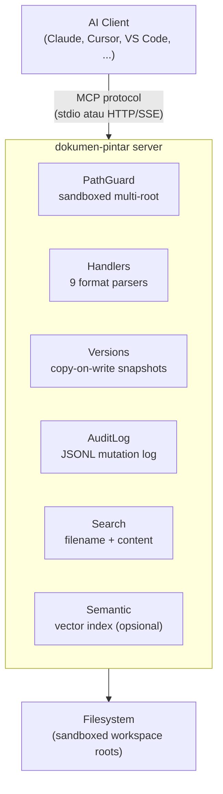

<p align="center">
  
</p>

<h1 align="center">Dokumen-Pintar</h1>

<p align="center"><b>MCP server universal untuk CRUD dokumen lintas format</b></p>

<p align="center">
Baca, tulis, cari, dan kelola file teks, Office, dan PDF<br>
dari AI agent manapun yang mendukung <a href="https://modelcontextprotocol.io/">Model Context Protocol</a>.
</p>

<p align="center">
  <a href="https://pypi.org/project/dokumen-pintar/"></a>&nbsp;
  <a href="https://python.org"></a>&nbsp;
  <a href="LICENSE"></a>&nbsp;
  <a href="tests/"></a>&nbsp;
  <a href="htmlcov/"></a>
</p>

<p align="center">
  <a href="#fitur">Fitur</a>
  <span>&nbsp;&middot;&nbsp;</span>
  <a href="#format-yang-didukung">Format</a>
  <span>&nbsp;&middot;&nbsp;</span>
  <a href="#quick-start">Quick Start</a>
  <span>&nbsp;&middot;&nbsp;</span>
  <a href="#daftar-tools">Tools</a>
  <span>&nbsp;&middot;&nbsp;</span>
  <a href="docs/">Docs</a>
  <span>&nbsp;&middot;&nbsp;</span>
  <a href="#kontribusi">Kontribusi</a>
</p>

<p align="center"><b><a href="README.md">Read in English</a></b></p>

---

## Fitur

<table>
<tr>
<td width="50%" valign="top">

**Multi-root Sandbox** — Definisikan beberapa workspace root dengan kontrol `writable` per-root. Semua path di luar sandbox ditolak otomatis.

**10 Format** — Plain text, Markdown, LaTeX, JSON / YAML, CSV / TSV, XML / SVG, DOCX, XLSX, PPTX, PDF.

**62 MCP Tools** — CRUD file & konten, structured access, batch operations, search, versioning, metadata, authoring, image extraction, sections, templates, TOC, bibliography, document compare, lint — semua tersedia sebagai tool yang bisa dipanggil AI agent.

**Versioning Otomatis** — Snapshot copy-on-write di setiap operasi tulis. Undo, diff, restore, dan purge kapan saja.

</td>
<td width="50%" valign="top">

**Structured Access** — JSONPath untuk JSON/YAML, XPath untuk XML, cell/range/sheet untuk XLSX, paragraph/table untuk DOCX, slide untuk PPTX, page untuk PDF.

**Batch Operations** — Rename, find-and-replace, dan delete massal dengan dry-run default.

**Semantic Search** *(opsional)* — Vector search berbasis sentence-transformers; aktifkan lewat config.

**Audit Trail** — Setiap mutasi dicatat ke file JSONL dengan timestamp dan detail operasi.

**2 Transport** — stdio (Claude Desktop, Cursor, VS Code, Windsurf) dan HTTP/SSE.

</td>
</tr>
</table>

---

## Format yang Didukung

| Format | Baca | Tulis | Structured Query | Search |
|:-------|:----:|:-----:|:-----------------|:------:|
| **Plain text / Markdown** | ✅ | ✅ | — | ✅ |
| **JSON** | ✅ | ✅ | JSONPath `$.key` | ✅ |
| **YAML** | ✅ | ✅ | JSONPath `$.key` | ✅ |
| **CSV / TSV** | ✅ | ✅ | `row:N` · `col:NAME` · `cell:row:N,col:NAME` | ✅ |
| **XML / SVG** | ✅ | ✅ | XPath `//node` | ✅ |
| **DOCX** | ✅ | ✅ | `paragraph:N` · `table:N` | ✅ |
| **XLSX** | ✅ | ✅ | `cell:Sheet!A1` · `range:` · `sheet:` | ✅ |
| **PPTX** | ✅ | ✅ | `slide:N` · `slide_title:N` | ✅ |
| **PDF** | ✅ | — | `page:N` · `outline` · `metadata` | ✅ |

---

## Quick Start

### 1. Install

```bash
pip install dokumen-pintar
```

<details>
<summary><b>Dari source (development)</b></summary>

```bash
git clone https://github.com/firdausmntp/Dokumen-Pintar.git
cd Dokumen-Pintar
pip install -e ".[dev]"
```

</details>

<details>
<summary><b>Dengan semantic search</b></summary>

```bash
pip install dokumen-pintar[semantic]
```

</details>

### 2. Buat Config

```bash
dokumen-pintar-init
```

Atau buat manual:

```jsonc
{
  "roots": [
    { "name": "documents", "path": "~/Documents", "writable": true },
    { "name": "projects",  "path": "~/Projects",  "writable": true }
  ]
}
```

> Semua field lain opsional dengan default yang masuk akal. Lihat **[docs/CONFIG.md](docs/CONFIG.md)**.

### 3. Jalankan

```bash
dokumen-pintar --config dokumen-pintar.config.json
```

#### Root ad-hoc tanpa config file

Override atau ganti root config dari command line — cocok untuk sesi
sekali pakai atau scripting:

```bash
# Single writable root, tidak butuh config file
dokumen-pintar --root docs:/path/ke/folder

# Multi-root, campur read-only & writable, transport stdio
dokumen-pintar \
  --root project:/repo:rw \
  --root refs:/library:ro \
  --transport stdio

# Paksa semua root jadi read-only (override config + --root)
dokumen-pintar --config myconfig.json --read-only

# Path-only (nama root diambil dari basename)
dokumen-pintar --root /home/saya/Documents
```

#### Health check

```bash
dokumen-pintar-doctor --config dokumen-pintar.config.json
```

Memverifikasi validitas config, keberadaan root, writability `.mcpdocs`,
handler yang terdaftar, dan dependency optional semantic-search.

### 4. Hubungkan ke AI Client

<details>
<summary><b>Claude Desktop</b></summary>

Tambahkan ke `claude_desktop_config.json`:

```json
{
  "mcpServers": {
    "dokumen-pintar": {
      "command": "dokumen-pintar",
      "args": ["--config", "/path/to/dokumen-pintar.config.json"]
    }
  }
}
```

</details>

<details>
<summary><b>Cursor / VS Code / Windsurf</b></summary>

Gunakan transport stdio yang sama. Arahkan pengaturan MCP di IDE ke command `dokumen-pintar` dan path config.

</details>

<details>
<summary><b>HTTP/SSE (remote atau multi-client)</b></summary>

```jsonc
{
  "transport": {
    "stdio": false,
    "http": { "enabled": true, "port": 7878 }
  }
}
```

Jalankan server dan arahkan client ke `http://127.0.0.1:7878`.

</details>

---

## Contoh Penggunaan

```python
# Lihat workspace roots yang tersedia
workspace_list_roots()

# Baca dokumen Word
content_read(path="documents:/laporan/q1.docx")

# Buat file baru
file_create(path="documents:/notes/catatan.txt", content="Hello World")

# Find & replace di dalam file
content_replace(path="documents:/notes/catatan.txt", old="World", new="Dunia")

# Full-text search di semua PDF
search_content(query="anggaran 2024", format="pdf")

# Baca cell Excel
structured_get(path="documents:/data.xlsx", expr="cell:Sheet1!B2")

# Update key JSON
structured_set(path="documents:/config.json", expr="$.database.port", value=5432)

# Hapus node XML
structured_delete(path="documents:/data.xml", expr="//item[@id='old']")

# Batch rename (dry-run dulu)
batch_rename(glob="*.txt", pattern="draft_", replacement="final_", dry_run=true)

# Undo perubahan terakhir
version_undo(path="documents:/laporan/q1.docx")
```

> Panduan lengkap dan resep praktis: **[docs/USAGE.md](docs/USAGE.md)**

---

## Daftar Tools

**62 MCP tools** berdasarkan kategori:

| Kategori | Tools |
|:---------|:------|
| **Workspace** | `workspace_list_roots` · `workspace_stat` · `workspace_tree` · `workspace_diagnose` |
| **File CRUD** | `file_create` · `file_delete` · `file_rename` · `file_copy` · `file_move` |
| **Content** | `content_read` · `content_write` · `content_append` · `content_insert` · `content_replace` · `content_delete_range` · `content_patch` · `content_diff` |
| **Structured** | `struct_get` · `struct_set` · `struct_delete` · `struct_meta` |
| **Metadata** | `metadata_read` · `metadata_write` · `metadata_delete` · `metadata_strip` · `metadata_read_batch` |
| **Authoring** | `validate_spec` · `compose_docx` · `compose_pdf` · `compose_from_markdown` · `compose_to_markdown` |
| **Sections** | `section_extract` · `section_merge` |
| **Images** | `image_list` · `image_extract` · `image_extract_all` · `image_replace` |
| **Templates** | `template_list` · `template_install` · `template_render` · `template_render_named` |
| **TOC & Bibliography** | `toc_generate` · `bibliography_check` · `bibliography_format` |
| **Compare & Lint** | `document_compare` · `document_lint` · `document_lint_fix` |
| **Batch** | `batch_rename` · `batch_replace_content` · `batch_replace_structured` · `batch_delete` |
| **Search** | `search_filename` · `search_content` · `search_in_format` |
| **Versioning** | `version_list` · `version_diff` · `version_restore` · `version_undo` · `version_purge` |
| **Semantic** * | `search_semantic` · `semantic_index_path` · `semantic_stats` |

<sub>* Hanya terdaftar jika <code>semantic_search.enabled = true</code> dan extras <code>[semantic]</code> terinstall.</sub>

> Referensi lengkap parameter: **[docs/TOOLS.md](docs/TOOLS.md)**

---

## Arsitektur



> Detail lengkap: **[docs/ARCHITECTURE.md](docs/ARCHITECTURE.md)**

---

## Testing

```bash
pip install -e ".[dev]"
pytest
```

<table align="center">
<tr>
  <td align="center" width="25%">
    <h2>1403</h2>
    <sub>Tests passed</sub>
  </td>
  <td align="center" width="25%">
    <h2>100%</h2>
    <sub>Line + branch coverage</sub>
  </td>
  <td align="center" width="25%">
    <h2>100%</h2>
    <sub>Minimum threshold</sub>
  </td>
  <td align="center" width="25%">
    <h2>-n auto</h2>
    <sub>Parallel via xdist</sub>
  </td>
</tr>
</table>

HTML coverage report: `htmlcov/index.html`

> Performa & metodologi: **[docs/BENCHMARK.md](docs/BENCHMARK.md)**

---

## Dokumentasi

| Dokumen | Isi |
|:--------|:----|
| **[USAGE.md](docs/USAGE.md)** | Workspace URI, contoh setiap tool, resep praktis |
| **[CONFIG.md](docs/CONFIG.md)** | Semua field config dengan tipe, default, dan catatan |
| **[TOOLS.md](docs/TOOLS.md)** | Referensi lengkap 62 tool |
| **[ARCHITECTURE.md](docs/ARCHITECTURE.md)** | Module map, request flow, versioning, safety |
| **[BENCHMARK.md](docs/BENCHMARK.md)** | Baseline performa dan metodologi |
| **[profiles/](docs/profiles/)** | Enam profile config siap pakai (personal, developer, research, ...) |
| **[AGENTS.md](AGENTS.md)** | Panduan kontributor: konvensi, dev workflow, proses PR |

---

## Kontribusi

```bash
git clone https://github.com/firdausmntp/Dokumen-Pintar.git
cd Dokumen-Pintar
pip install -e ".[dev]"

ruff check src/             # lint
mypy src/dokumen_pintar/    # type check
pytest                      # test + coverage
```

PR welcome! Pastikan semua test pass dan coverage tidak turun.

---

## Lisensi

[MIT](LICENSE) — 2026 [firdausmntp](https://github.com/firdausmntp/Dokumen-Pintar)

---

<p align="center">
  <sub>Dibuat oleh <a href="https://github.com/firdausmntp">firdausmntp</a></sub>
</p>
