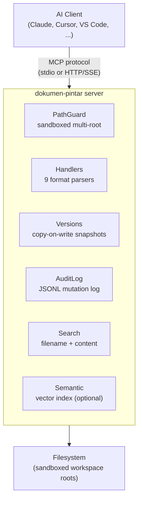

<p align="center">
  
</p>

<h1 align="center">Dokumen-Pintar</h1>

<p align="center"><b>Universal MCP server for cross-format document CRUD</b></p>

<p align="center">
Read, write, search, and manage text, Office, and PDF files<br>
from any AI agent that supports the <a href="https://modelcontextprotocol.io/">Model Context Protocol</a>.
</p>

<p align="center">
  <a href="https://pypi.org/project/dokumen-pintar/"></a>&nbsp;
  <a href="https://python.org"></a>&nbsp;
  <a href="LICENSE"></a>&nbsp;
  <a href="tests/"></a>&nbsp;
  <a href="htmlcov/"></a>
</p>

<p align="center">
  <a href="#features">Features</a>
  <span>&nbsp;&middot;&nbsp;</span>
  <a href="#supported-formats">Formats</a>
  <span>&nbsp;&middot;&nbsp;</span>
  <a href="#quick-start">Quick Start</a>
  <span>&nbsp;&middot;&nbsp;</span>
  <a href="#tools-overview">Tools</a>
  <span>&nbsp;&middot;&nbsp;</span>
  <a href="docs/">Docs</a>
  <span>&nbsp;&middot;&nbsp;</span>
  <a href="#contributing">Contributing</a>
</p>

<p align="center"><b><a href="README.id.md">Baca dalam Bahasa Indonesia</a></b></p>

---

## Features

<table>
<tr>
<td width="50%" valign="top">

**Multi-root Sandbox** — Define multiple workspace roots with per-root `writable` control. All paths outside the sandbox are rejected.

**10 Formats** — Plain text, Markdown, JSON, YAML, CSV/TSV, XML/SVG, DOCX, XLSX, PPTX, PDF.

**30 MCP Tools** — File & content CRUD, structured access, batch operations, search, versioning — all exposed as callable tools for AI agents.

**Automatic Versioning** — Copy-on-write snapshots on every write operation. Undo, diff, restore, and purge anytime.

</td>
<td width="50%" valign="top">

**Structured Access** — JSONPath for JSON/YAML, XPath for XML, cell/range/sheet for XLSX, paragraph/table for DOCX, slide for PPTX, page for PDF.

**Batch Operations** — Mass rename, find-and-replace, and delete with dry-run by default.

**Semantic Search** *(optional)* — Vector search powered by sentence-transformers; enable via config.

**Audit Trail** — Every mutation logged to JSONL with timestamp and operation details.

**2 Transports** — stdio (Claude Desktop, Cursor, VS Code, Windsurf) and HTTP/SSE.

</td>
</tr>
</table>

---

## Supported Formats

| Format | Read | Write | Structured Query | Search |
|:-------|:----:|:-----:|:-----------------|:------:|
| **Plain text / Markdown** | ✅ | ✅ | — | ✅ |
| **JSON** | ✅ | ✅ | JSONPath `$.key` | ✅ |
| **YAML** | ✅ | ✅ | JSONPath `$.key` | ✅ |
| **CSV / TSV** | ✅ | ✅ | `row:N` · `col:NAME` · `cell:row:N,col:NAME` | ✅ |
| **XML / SVG** | ✅ | ✅ | XPath `//node` | ✅ |
| **DOCX** | ✅ | ✅ | `paragraph:N` · `table:N` | ✅ |
| **XLSX** | ✅ | ✅ | `cell:Sheet!A1` · `range:` · `sheet:` | ✅ |
| **PPTX** | ✅ | ✅ | `slide:N` · `slide_title:N` | ✅ |
| **PDF** | ✅ | — | `page:N` · `outline` · `metadata` | ✅ |

---

## Quick Start

### 1. Install

```bash
pip install dokumen-pintar
```

<details>
<summary><b>From source (development)</b></summary>

```bash
git clone https://github.com/firdausmntp/Dokumen-Pintar.git
cd Dokumen-Pintar
pip install -e ".[dev]"
```

</details>

<details>
<summary><b>With semantic search</b></summary>

```bash
pip install dokumen-pintar[semantic]
```

</details>

### 2. Create a Config

```bash
dokumen-pintar-init
```

Or create one manually:

```jsonc
{
  "roots": [
    { "name": "documents", "path": "~/Documents", "writable": true },
    { "name": "projects",  "path": "~/Projects",  "writable": true }
  ]
}
```

> All other fields are optional with sensible defaults. See **[docs/CONFIG.md](docs/CONFIG.md)**.

### 3. Run

```bash
dokumen-pintar --config dokumen-pintar.config.json
```

#### Ad-hoc roots without a config file

Override or replace config roots from the command line — handy for one-off
sessions or scripting:

```bash
# Single writable root, no config file required
dokumen-pintar --root docs:/path/to/folder

# Multiple roots, mix read-only and writable, choose stdio transport
dokumen-pintar \
  --root project:/repo:rw \
  --root refs:/library:ro \
  --transport stdio

# Force every root to read-only (overrides config + --root)
dokumen-pintar --config myconfig.json --read-only

# Path-only shorthand (root name derived from basename)
dokumen-pintar --root /home/me/Documents
```

#### Health check

```bash
dokumen-pintar-doctor --config dokumen-pintar.config.json
```

Verifies config validity, root existence, `.mcpdocs` snapshot writability,
registered handlers, and optional semantic-search dependencies.

### 4. Connect to an AI Client

<details>
<summary><b>Claude Desktop</b></summary>

Add to your `claude_desktop_config.json`:

```json
{
  "mcpServers": {
    "dokumen-pintar": {
      "command": "dokumen-pintar",
      "args": ["--config", "/path/to/dokumen-pintar.config.json"]
    }
  }
}
```

</details>

<details>
<summary><b>Cursor / VS Code / Windsurf</b></summary>

Use the same stdio transport. Point your IDE's MCP settings to the `dokumen-pintar` command and config path.

</details>

<details>
<summary><b>HTTP/SSE (remote or multi-client)</b></summary>

```jsonc
{
  "transport": {
    "stdio": false,
    "http": { "enabled": true, "port": 7878 }
  }
}
```

Start the server and connect your client to `http://127.0.0.1:7878`.

</details>

---

## Usage Examples

```python
# List available workspace roots
workspace_list_roots()

# Read a Word document
content_read(path="documents:/reports/q1.docx")

# Create a new file
file_create(path="documents:/notes/todo.txt", content="Hello World")

# Find & replace inside a file
content_replace(path="documents:/notes/todo.txt", old="World", new="Everyone")

# Full-text search across all PDFs
search_content(query="budget 2024", format="pdf")

# Read an Excel cell
structured_get(path="documents:/data.xlsx", expr="cell:Sheet1!B2")

# Update a JSON key
structured_set(path="documents:/config.json", expr="$.database.port", value=5432)

# Delete an XML node
structured_delete(path="documents:/data.xml", expr="//item[@id='old']")

# Batch rename (dry-run first)
batch_rename(glob="*.txt", pattern="draft_", replacement="final_", dry_run=true)

# Undo last change
version_undo(path="documents:/reports/q1.docx")
```

> Full guide with recipes: **[docs/USAGE.md](docs/USAGE.md)**

---

## Tools Overview

**30 MCP tools** organized by category:

| Category | Tools |
|:---------|:------|
| **Workspace** | `workspace_list_roots` · `workspace_stat` · `workspace_tree` |
| **File CRUD** | `file_create` · `file_delete` · `file_rename` · `file_copy` · `file_move` |
| **Content** | `content_read` · `content_write` · `content_append` · `content_insert` · `content_replace` · `content_patch` |
| **Structured** | `structured_get` · `structured_set` · `structured_delete` · `structured_meta` |
| **Batch** | `batch_rename` · `batch_replace_content` · `batch_delete` |
| **Search** | `search_filename` · `search_content` · `search_in_format` |
| **Versioning** | `version_list` · `version_diff` · `version_restore` · `version_undo` · `version_purge` |
| **Semantic** * | `semantic_index` · `semantic_search` |

<sub>* Only available when <code>semantic_search.enabled = true</code> and <code>[semantic]</code> extras are installed.</sub>

> Full parameter reference: **[docs/TOOLS.md](docs/TOOLS.md)**

---

## Architecture



> Full details: **[docs/ARCHITECTURE.md](docs/ARCHITECTURE.md)**

---

## Testing

```bash
pip install -e ".[dev]"
pytest
```

<table align="center">
<tr>
  <td align="center" width="25%">
    <h2>730</h2>
    <sub>Tests passed</sub>
  </td>
  <td align="center" width="25%">
    <h2>100%</h2>
    <sub>Line + branch coverage</sub>
  </td>
  <td align="center" width="25%">
    <h2>80%</h2>
    <sub>Minimum threshold</sub>
  </td>
  <td align="center" width="25%">
    <h2>-n auto</h2>
    <sub>Parallel via xdist</sub>
  </td>
</tr>
</table>

HTML coverage report: `htmlcov/index.html`

---

## Documentation

| Document | Contents |
|:---------|:---------|
| **[USAGE.md](docs/USAGE.md)** | Workspace URIs, tool examples, practical recipes |
| **[CONFIG.md](docs/CONFIG.md)** | All config fields with types, defaults, and notes |
| **[TOOLS.md](docs/TOOLS.md)** | Full reference for all 30 tools |
| **[ARCHITECTURE.md](docs/ARCHITECTURE.md)** | Module map, request flow, versioning, safety |

---

## Contributing

```bash
git clone https://github.com/firdausmntp/Dokumen-Pintar.git
cd Dokumen-Pintar
pip install -e ".[dev]"

ruff check src/             # lint
mypy src/dokumen_pintar/    # type check
pytest                      # test + coverage
```

PRs welcome. All tests must pass and coverage must not decrease.

---

## License

[MIT](LICENSE) — 2026 [firdausmntp](https://github.com/firdausmntp/Dokumen-Pintar)

---

<p align="center">
  <sub>Built by <a href="https://github.com/firdausmntp">firdausmntp</a></sub>
</p>
